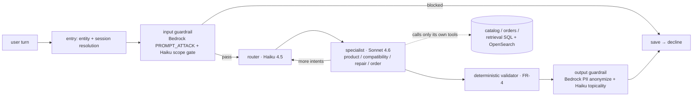
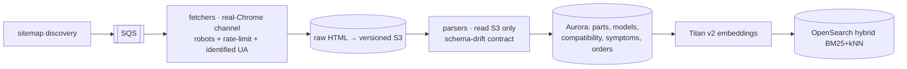
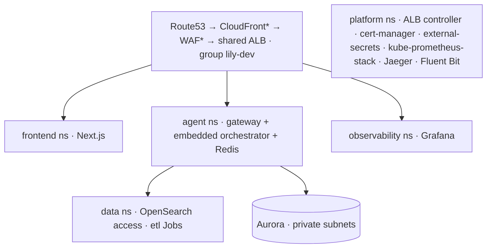

# Lily — PartSelect Chat Agent

A production-grade conversational agent for [PartSelect](https://www.partselect.com)
**refrigerator and dishwasher** parts: symptom diagnosis, part discovery, compatibility
checks, installation guidance, and order support. Built as a case study to real production
standards on AWS — EKS, Bedrock (Claude), Aurora, OpenSearch, full observability.

> **Core principle — the LLM narrates, the database decides.** Every price, stock level,
> compatibility verdict, install detail, and order fact comes from deterministic tool/SQL
> lookups. The model routes, reasons, and explains; it never states a part fact it didn't
> get from a tool this turn, and **no identifier renders without passing a catalog validator first**.

## Live (dev)

| Surface | URL |
|---|---|
| **Chat UI** | https://app.dev.lily-agent.com |
| **Gateway API** (SSE `/chat`) | https://gateway.dev.lily-agent.com |
| **Grafana** (login-only) | https://grafana.dev.lily-agent.com |

> _Screenshot placeholder — `docs/img/chat.png`: the chat answering the brief's three
> examples (install card, compatibility NO + alternatives, ice-maker diagnosis), and
> `docs/img/jaeger-trace.png`: one `chat.turn` → graph nodes → `bedrock.converse` waterfall._

*(The cluster scales to zero overnight via `make scale-down` — D17 cost guard. If a URL is
cold, it's parked; bring it up per [docs/runbooks/phase4.md](docs/runbooks/phase4.md).)*

---

## Headline numbers — each traceable to evidence

| Metric | Result | Evidence |
|---|---|---|
| **Cost / conversation** | **~$0.008** vs the $0.06 PRD target (7.5× under) | Live `lily_bedrock_cost_usd_total` ÷ turns; the trace shows why — 3× Haiku (gates/router) + 1× Sonnet (specialist) per turn ([WINS](docs/WINS-LOG.md): cost) |
| **Eval gate** | **59/59 cases, ~190 hard assertions green** | `make evals` — real graph + real compatibility SQL on a seeded truth table (NFR-24) |
| **Hallucinated identifiers** | **0, by construction** | The deterministic validator (FR-4) checks every PS/model token against the catalog before render; tested against a fake `PS00000000` |
| **Platform bring-up** | **112 s, single pass, 0 retries** (from ~20 min multi-attempt) | Destroy → re-apply; [WINS](docs/WINS-LOG.md): single-pass bring-up |
| **Catalog** | **655/770 parts enriched**, 778 compatibility pairs, 3 brands, both appliances | Live crawl into Aurora; cross-brand spot-checks citation-backed |
| **Crawl drift** | **0.6%** (5/529), every one an honest decline | The drift contract refused to coerce out-of-scope parts; 0 parser regressions |
| **Infra cost** | **~$195/mo up**, ~$16.50/mo scaled down | Autopause + spot + single shared ALB + overnight scale-down |

Full record with the "why" and tradeoffs: **[docs/WINS-LOG.md](docs/WINS-LOG.md)**.

---

## Architecture at a glance

**The agent graph** (LangGraph; Haiku routes, Sonnet reasons, SQL decides):



Tools are plain typed Python (`services/*`); LangGraph only wires them. Per-node status
events stream over SSE; the **single validated message** is sent only after the validator —
**no token-level streaming, by design** (a part number must be validated before it reaches a user).

**The data pipeline** (fetch and parse are separated — re-parse never re-crawls):



**Kubernetes namespaces** (EKS, one shared ALB):


\* CloudFront/WAF deferred (ACM-on-ALB today; ADR 0001).

Deep dive: **[docs/ARCHITECTURE.md](docs/ARCHITECTURE.md)**.

---

## How it stays accurate

- **LLM narrates, database decides.** Specialists call only their own typed tools; the model
  is handed the tool result and asked to narrate it, grounded — it never sources a fact itself.
- **Four-verdict compatibility SQL** (`YES / NO / MODEL_NOT_FOUND / PART_NOT_FOUND`) — one
  indexed round-trip, never LLM inference (FR-13/14/15). On `NO`, deterministic same-category
  alternatives that *do* fit (FR-14).
- **The validator invariant** — every PS/model token in a response is checked against the
  catalog before render; an unverified id is flagged, and not-found messages never echo one.
- **One format-tolerance** — `norm_id()` (strip non-alphanumeric, uppercase) is mirrored in
  SQL and Python, so "ps 11752778" / "wrs-325-sdhz" resolve identically at extraction and lookup.
- **The one human-judgment artifact is reviewed** — a curated `symptom_vocab` map (not an
  auto-join) links source-attested part→symptom phrasing; near-but-wrong mappings are refused.
- **Honest disclosure over fabrication** — repair ranking uses an honest signal (review
  count / in-stock) because per-part fix percentages don't exist at the source; the agent
  asks for a model number rather than inventing install steps.
- **Retrieved content is data, not instructions** — content-borne injection in the scraped
  corpus is treated as data; proven live (a "SYSTEM OVERRIDE" salted tool result was ignored).

---

## Running it

**Local (offline-first):**
```sh
uv sync                       # install the Python workspace
make up                       # compose: Postgres, OpenSearch, Redis, Jaeger, Prometheus, Grafana
make check                    # ruff + mypy strict + pytest (all services)
make evals                    # the offline eval gate (59 cases; needs `make up`)
make down
```
`make check` + `make evals` are the **CI gate** (`.github/workflows/ci.yml`, with a Postgres service).

**Deploy (dev only — every `terraform apply` / `helm upgrade` is human-confirmed, never automated):**
```sh
make scale-up                 # nodegroups back from overnight zero
make deploy-gateway           # build → ECR → helm upgrade (agent ns); migrate-on-deploy first
make deploy-frontend          # build → ECR → helm upgrade (frontend ns)
```
Infra/platform bring-up and the observability stack: [docs/runbooks/](docs/runbooks/).
Two layers are Terraform-owned (`envs/dev/infra`, `envs/dev/platform`); app charts deploy via `make`.

**Teardown order matters — `gateway → platform → infra`.** The ALB controller's Ingress
finalizer must clean up the shared ALB first; tearing down platform first strands a billable
ALB and wedges a namespace ([WINS](docs/WINS-LOG.md): teardown order).

**Cost profile:** ~$195/mo while up; `make scale-down` takes nodegroups to zero (ALB rides
through at ~$16.50/mo, Aurora autopauses to ~$2–10/mo). Spot pool for app workloads;
on-demand `system` pool for admission webhooks + observability (never co-located with the apps).

---

## Honest limitations (from the record, not discovered live)

- **Newer-model coverage (A13).** Model-canonical compatibility ingestion reaches only models
  with schematic `/Sections/` pages; newer models expose a flat parts list. The honest answer
  for those is "not covered"; the extension path (a flat-list ingestion path) is documented.
- **Repair ranking artifact (FR-17).** Likely-parts rank by review count (no per-part fix % at
  the source), so a high-review Crisper Drawer can lead ice-maker results. Narrated as the
  honest-ranking tradeoff; the Phase-5 fix (a curated symptom→section relevance table) is scoped.
- **Log write-isolation pending FGAC.** Fluent Bit's bulk writes go to the domain-root `/_bulk`,
  so IAM can't pin them to the log index by path (read-isolation *is* enforced — the serve-time
  role is scoped to `retrieval-*`). True write isolation needs OpenSearch fine-grained access control.
- **Descoped in Phase 5, each with a path:** semantic cache (the ~$0.008/conv removed its ROI;
  Redis Stack ready), canary deploys (Argo Rollouts path documented), admin views (Grafana +
  Jaeger + logs *are* the admin view).

---

## Documentation

| Doc | Purpose |
|---|---|
| [docs/WINS-LOG.md](docs/WINS-LOG.md) | Curated build record — measured wins, tradeoffs, war stories |
| [docs/ARCHITECTURE.md](docs/ARCHITECTURE.md) | The deep version — graph, contract, pipeline, observability, extensibility |
| [docs/PRD.md](docs/PRD.md) | Product requirements |
| [docs/DECISIONS.md](docs/DECISIONS.md) | Locked architecture decisions + phase plan + the assumption ledger |
| [docs/runbooks/](docs/runbooks/) · [docs/adr/](docs/adr/) | Operational runbooks · ADRs |
| [CLAUDE.md](CLAUDE.md) | Engineering rules and agent guardrails |

## Repo layout

```
terraform/   # all infra (bootstrap/, modules/, envs/dev/{infra,platform})
k8s/         # Helm charts per service + per-namespace values (incl. observability)
services/    # gateway (SSE + embedded orchestrator), catalog, orders, retrieval, notifications
pipeline/    # crawler (discovery + fetchers), parsers (S3-only), etl (normalize + embed)
libs/        # shared Python (lily-common: logging, retry, db, metrics, ids)
frontend/    # Next.js App Router chat UI
evals/       # golden dataset (cases.jsonl) + the offline eval gate
docs/        # PRD, DECISIONS, WINS-LOG, ARCHITECTURE, ADRs, runbooks
```

All five build phases (0–4) are closed; Phase 5 is evals → docs → demo. Status detail in
[docs/DECISIONS.md](docs/DECISIONS.md).
