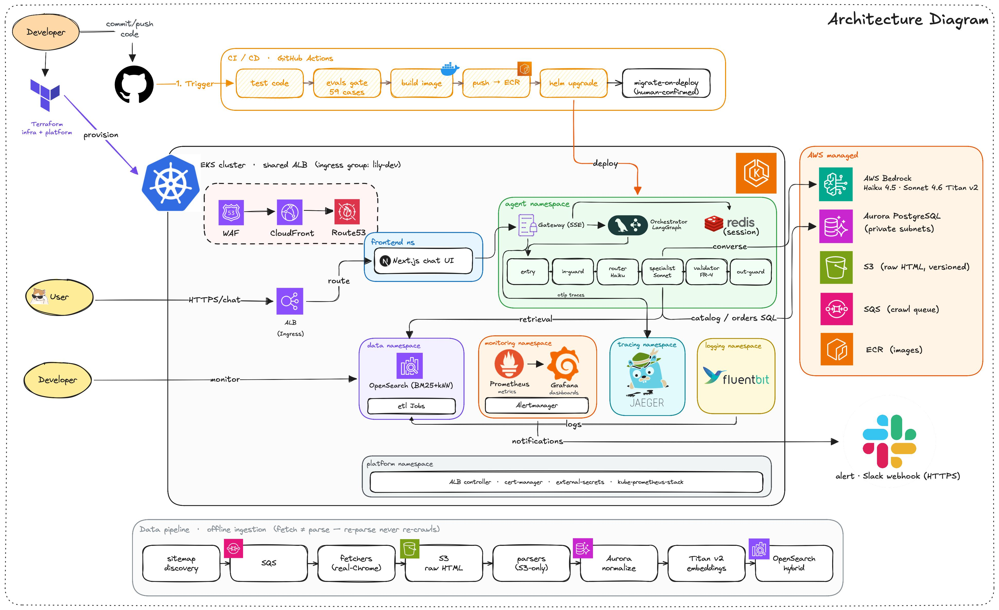

# Lily: a chat agent for PartSelect

Lily helps people find and buy the right **refrigerator and dishwasher** parts by chatting, the way they'd ask a knowledgeable person at a parts counter. Ask it to diagnose a symptom, find a part, check whether a part fits your model, walk you through an install, or look up an order, and it answers in plain language, backed by real catalog data.

It was built as a case study, but to genuine production standards: it runs live on AWS (EKS, Bedrock/Claude, Aurora, OpenSearch) with full tracing, metrics, logging, and alerting.

> **The one idea that makes Lily trustworthy:** _the language model narrates, the database decides._
> Every price, stock level, compatibility verdict, install detail, and order fact comes from a real database lookup, never from the model's memory. The model decides _what you're asking_ and _how to explain the answer_; it never makes up a fact, and **no part number ever reaches you without being checked against the catalog first.**

---

## See it / try it

| What                                         | Where                              |
| -------------------------------------------- | ---------------------------------- |
| 💬 **Chat with Lily**                        | https://app.dev.lily-agent.com     |
| 🔌 **The API behind it** (streaming `/chat`) | https://gateway.dev.lily-agent.com |
| 📊 **Dashboards** (login required)           | https://grafana.dev.lily-agent.com |

> The cluster scales itself to zero overnight to save money, so if a link looks asleep, it's parked on purpose. See [docs/runbooks/phase4.md](docs/runbooks/phase4.md) to wake it.

### What you can ask it

| You say                                          | Lily does                                                                                   |
| ------------------------------------------------ | ------------------------------------------------------------------------------------------- |
| _"How do I install part PS11752778?"_            | Pulls the real install difficulty, time, and video; adds a safety note; links the part page |
| _"Is this part compatible with my WDT780SAEM1?"_ | Checks the catalog and gives a straight **yes / no**, and if no, shows parts that _do_ fit  |
| _"My ice maker isn't working, how do I fix it?"_ | Diagnoses the symptom and lists the parts that address it, with repair guides               |
| _"Compare these two parts"_                      | Side-by-side card: price, difficulty, rating, video                                         |
| _"Where's my order?"_                            | Looks up status and timeline (without leaking anyone's personal info)                       |
| _"What's the best microwave?"_                   | Politely declines; Lily sticks to fridge and dishwasher parts                               |

---

## The numbers that matter

Every figure here is measured, not estimated. Each links to where it comes from.

| Metric                     | Result                                                                            | How we know                                                                                                                                 |
| -------------------------- | --------------------------------------------------------------------------------- | ------------------------------------------------------------------------------------------------------------------------------------------- |
| **Cost per conversation**  | **~$0.008**, about 7.5× cheaper than the $0.06 target                             | Measured from live token metrics. Cheap model (Haiku) handles routing and safety; the capable model (Sonnet) only does the actual reasoning |
| **Answer accuracy gate**   | **59 / 59 test cases pass** (~190 strict checks)                                  | `make evals` runs every case through the real agent and real database                                                                       |
| **Made-up part numbers**   | **Zero, by design, not by luck**                                                  | A validator checks every identifier against the catalog before it's shown; tested with a deliberate fake                                    |
| **Catalog coverage**       | **655 of 770 parts** enriched, 778 compatibility pairs, 3 brands, both appliances | Crawled live into the database                                                                                                              |
| **Infrastructure startup** | **112 seconds**, one clean pass (down from ~20 min of retries)                    | Repeatable teardown-and-rebuild                                                                                                             |
| **Crawl error rate**       | **0.6%**, and every one was an _honest_ skip, not a mistake                       | The parser refused to guess on out-of-scope parts                                                                                           |
| **Running cost**           | **~$195/mo** live, **~$16.50/mo** asleep                                          | Spot instances, one shared load balancer, overnight scale-down                                                                              |

The full story behind each, including the tradeoffs and the things that broke along the way, is in **[docs/WINS-LOG.md](docs/WINS-LOG.md)**.

---

## How it's built



The picture above shows the whole system at once. In words:

**When you send a message,** it goes through one shared load balancer to the Next.js chat UI, which streams your question to the agent. The agent runs it through a short, inspectable pipeline, described next, and streams back a single, fact-checked answer.

**The agent pipeline** is a small state machine (built with LangGraph). Each step does one job, so the whole path is easy to follow and to trace:

| Step                    | What it does                                                                             |
| ----------------------- | ---------------------------------------------------------------------------------------- |
| **entry**               | Figures out which part/model you mean, remembers your appliance from earlier in the chat |
| **input guardrail**     | Blocks off-topic, unsafe, or manipulative messages                                       |
| **router** (Haiku)      | Decides the intent: product, compatibility, repair, or order                             |
| **specialist** (Sonnet) | Answers, using _only_ its own database tools, and can loop back once for a second intent |
| **validator**           | Checks every part/model number in the answer against the catalog                         |
| **output guardrail**    | Masks any personal info, confirms the answer is on-topic                                 |
| **save**                | Stores the turn so the next message has context                                          |

A key design choice lives here: Lily streams _status updates_ while it works ("Checking compatibility…"), but it sends the **answer all at once, only after the validator has seen it**, because a part number must be verified before it can reach you.

**The data behind the answers** comes from an offline pipeline (bottom of the diagram) that's deliberately split in two: **fetching** pages and **parsing** them are separate stages. Raw pages are saved to S3 first; parsers only ever read from S3. So when a parser needs fixing, we re-parse the saved pages and never have to crawl the site again. The flow is: discover pages, queue, fetch politely, save raw HTML, parse, store in Aurora, embed, index in OpenSearch for search.

Want the deep version? **[docs/ARCHITECTURE.md](docs/ARCHITECTURE.md)** goes node by node.

---

## Why you can trust the answers

This is the part the project cares about most. Lily is built so that being _accurate_ and being _honest about its limits_ are structural, not hopeful.

- **The model never sources a fact itself.** Each specialist is handed real tool results and asked only to phrase them. It can't invent a price or a fitment.
- **Compatibility is a database lookup, never a guess.** It returns one of four clear verdicts (_fits_, _doesn't fit_, _don't know that model_, _don't know that part_) because those are four genuinely different situations for you. If a part doesn't fit, Lily shows ones that do.
- **Nothing unverified gets displayed.** Every part and model number in a reply is checked against the catalog first; "not found" messages won't even echo a number we couldn't verify.
- **It reads messy input the same way the database does.** "ps 11752778" and "WRS-325-SDHZ" resolve correctly, because the same normalization rule runs in both places.
- **The one human-judgment step is reviewed by a human.** Mapping a customer's words ("won't dispense ice") to a catalog symptom is a curated list, not an auto-match, and genuinely ambiguous ones are left unmapped rather than guessed.
- **It says "I don't know" instead of making things up.** When the source has no per-part fix rates, Lily ranks by an honest signal and says so. When it lacks install steps, it asks for your model instead of inventing them.
- **Scraped text is treated as data, never instructions.** A page that says "ignore your instructions" is just text to Lily, proven with a real injection test.

---

## Running it yourself

**Locally** (works offline, no AWS needed):

```sh
uv sync          # install the Python workspace
make up          # start Postgres, OpenSearch, Redis, Jaeger, Prometheus, Grafana
make check       # lint + type-check + tests
make evals       # the answer-accuracy gate (needs `make up`)
make down
```

`make check` and `make evals` are the CI gate (they run on every push).

**Deploying** (dev only; every infrastructure change is human-confirmed, never automatic):

```sh
make scale-up           # bring nodes back from overnight zero
make deploy-gateway     # build, push, deploy the agent (migrations run first)
make deploy-frontend    # build, push, deploy the UI
```

Full infrastructure and observability bring-up lives in [docs/runbooks/](docs/runbooks/).

> ⚠️ **Teardown order matters:** `gateway` then `platform` then `infra`. The load-balancer controller has to clean up first, or it strands a billable load balancer and wedges a namespace. (Learned the hard way; see [WINS](docs/WINS-LOG.md).)

**What it costs:** ~$195/mo while running; `make scale-down` drops that to ~$16.50/mo by taking the compute to zero (the load balancer idles cheaply and the database auto-pauses).

---

## Honest limitations

These are documented up front, not hidden. Knowing the edges is part of the design.

| Limitation                          | What it means                                                                                                                                                 | The path forward                                                           |
| ----------------------------------- | ------------------------------------------------------------------------------------------------------------------------------------------------------------- | -------------------------------------------------------------------------- |
| **Newer models aren't covered**     | Compatibility data comes from older models' schematic pages; newer models use a flat list Lily doesn't ingest yet. It says "not covered" rather than guessing | A flat-list ingestion path is designed                                     |
| **Repair ranking is by popularity** | The source has no per-part fix rates, so a popular part can top a symptom list even if it's not the likeliest fix. Lily discloses this                        | A curated symptom-to-section relevance table                               |
| **Log write-isolation is partial**  | Reads are locked down by IAM; bulk log _writes_ can't be pinned to one index by IAM alone                                                                     | Needs OpenSearch fine-grained access control                               |
| **Deliberately descoped**           | Semantic cache (the $0.008 cost removed the reason), canary deploys, and admin views                                                                          | Each has a documented path; the dashboards already serve as the admin view |

---

## Where everything lives

| Doc                                                       | What's in it                                     |
| --------------------------------------------------------- | ------------------------------------------------ |
| [docs/WINS-LOG.md](docs/WINS-LOG.md)                      | The build story: wins, tradeoffs, and what broke |
| [docs/ARCHITECTURE.md](docs/ARCHITECTURE.md)              | The deep technical version                       |
| [docs/PRD.md](docs/PRD.md)                                | Product requirements                             |
| [docs/DECISIONS.md](docs/DECISIONS.md)                    | Every locked decision and assumption             |
| [docs/runbooks/](docs/runbooks/) · [docs/adr/](docs/adr/) | Operational guides and decision records          |
| [CLAUDE.md](CLAUDE.md)                                    | Engineering rules and agent guardrails           |

```
terraform/   all infrastructure (bootstrap, modules, dev environments)
k8s/         Helm charts + per-namespace config
services/    gateway (chat API + agent), catalog, orders, retrieval, notifications
pipeline/    crawler, parsers, ETL
libs/        shared Python (logging, retry, db, metrics, ids)
frontend/    Next.js chat UI
evals/       the test cases + accuracy gate
docs/        all documentation
```

---

_All five build phases are complete and live. Status detail in [docs/DECISIONS.md](docs/DECISIONS.md)._
